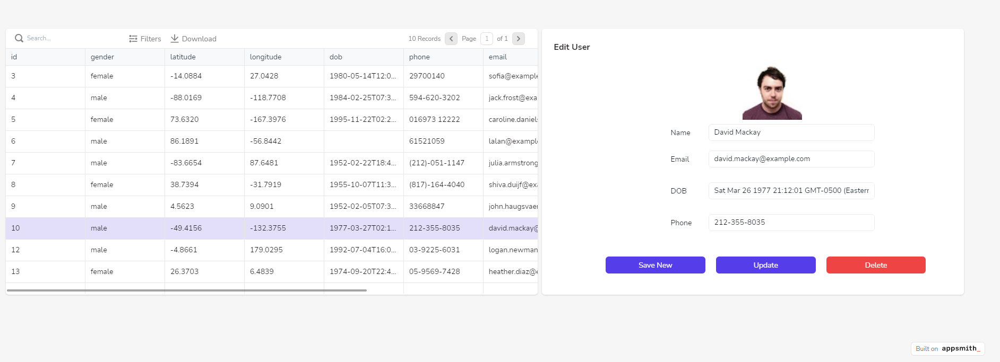

<h1 align="center">
   
  
   
</h1>

 

# Appsmith Overview

> Appsmith is full-stack application development tool designed for internal tool usage like email-campaign dashboards, customer-analysis for your specific database, product inventory management, data visualization pages, discord bots, and so on.

## Quickstart Guides

  

    

      
      

        <h5 class="card-title">Create Basic SQL Admin Panel</h5>
        
15 steps to build your SQL Table admin panel.

        <a href="/#/guides/sql-admin-panel" class="btn btn-dark">Read</a>
      

    

  

  <a href="https://www.youtube.com/appsmith">YouTube</a> •
  <a
    href="https://www.appsmith.com/templates?utm_source=github&utm_medium=organic&utm_campaign=readme&utm_content=top">Templates</a>

## Appsmith Support and Community

  

  

Issues are inevitable. When you have one, Appsmith's entire team and active developer community is around to help. 

💬 Connect with others on [Discord](https://discord.gg/rBTTVJp) 
📄 Find a solution in official [Documentation](https://docs.appsmith.com?utm_source=github&utm_medium=organic&utm_campaign=readme) 
⚠️ Open an issue right here on [GitHub](https://github.com/appsmithorg/appsmith/issues/new/choose) 
👾 Ask for help on [Appsmith Forum](https://community.appsmith.com) 
💡Use Appsmith learning resources: [Templates](https://www.appsmith.com/templates?utm_source=github&utm_medium=organic&utm_campaign=readme&utm_content=support), [Tutorials](https://www.appsmith.com/blog-categories/tutorial?utm_source=github&utm_medium=organic&utm_campaign=readme), and [Videos](https://www.youtube.com/appsmith) 

## License

Appsmith is available under the [Apache License 2.0](https://github.com/appsmithorg/appsmith/blob/release/LICENSE). Use it wisely.